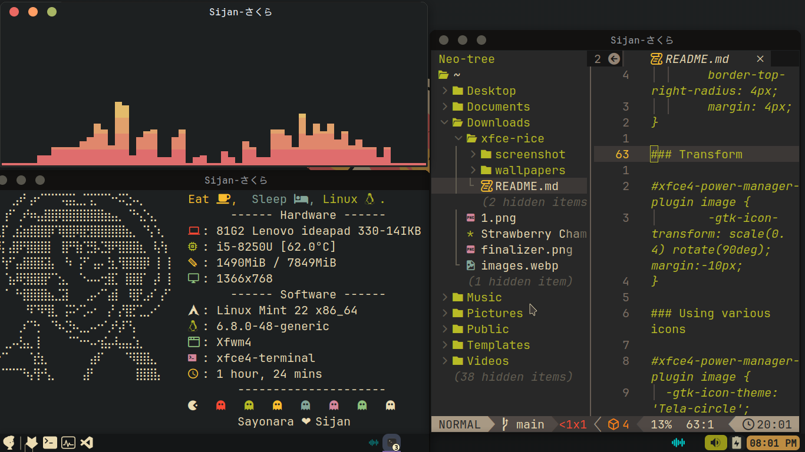

# Linux-Mint Post Installation

All the dot-files can be copied into the system after the installation.

## Screenshots



## Getting Started

First of all open the _mint-install.sh_ file and then copy all the required commands or you can also edit those and run the scripts.

### Prerequisites

```bash
# Sudo without password (optional)

sudo visudo

username ALL=(ALL) NOPASSWD: ALL  #paste into visudo

# Get the latest updates
sudo apt update && sudo apt -y upgrade

#Nala- a GUI package manager - alt of (apt)
sudo apt install -y nala btop neofetch ffmpeg

#Redshift install
sudo apt install -y redshift redshift-gtk

# Multimedia codecs
sudo apt install -y ubuntu-restricted-extras

# Rar and other archiving utilities
sudo apt install -y unace p7zip-rar sharutils rar arj lunzip lzip gdebi

# Clipboard manager, Stacer VLC Cmus(music player) ddgr(google search)
sudo apt install -y diodon stacer mpv cmus ddgr

# QBittorrent Client
sudo apt install -y qbittorrent

# Microsoft font (optional)
sudo apt install -y ttf-mscorefonts-installer

# Install useful packages
sudo apt install -y curl aria2 jq make gcc git neovim fzf sed

#Install Homebrew
/bin/bash -c "$(curl -fsSL https://raw.githubusercontent.com/Homebrew/install/HEAD/install.sh)"

 #Customize terminal with Oh my Posh
curl -s https://ohmyposh.dev/install.sh | bash -s

eval "$(oh-my-posh init bash --config ~/Downloads/dotfiles/.config/.poshthemes/robbyrussell.omp.json)"

#Tips for installing any font
sudo mkdir ~/.fonts && sudo mv font.ttf ~/.fonts

fc-cache

#Change Terminal Looks
sudo curl -Lo /usr/bin/theme.sh 'https://git.io/JM70M' && sudo chmod +x /usr/bin/theme.sh

theme.sh -i #then run this command to change theme

#sudo-insults
vi sudo
Defaults insults  #Add this command in sudo file
```

### Installation

A step by step guide that will tell you how to get the development environment up and running.

```bash
# Clone this repository
 git clone https://github.com/Sijan-Bhusal/dotfiles.git

# Go into the repository
 cd dotfiles

# Run mint-install.sh
chmod +x mint-install.sh

# Run the script
./mint-install.sh
```

**Note**: After that you copy all the configs file into your config folder ~/.config. And also copy all other wallpapers and important files.

## Useful CLI-TOOLS

```bash

#Useful CLI tools
#Zoxide
curl -sSfL https://raw.githubusercontent.com/ajeetdsouza/zoxide/main/install.sh | sh

#ani-cli
sudo apt install -y ani-cli

#ranger
sudo apt install

#sudo


```

## Useful Links

**1.Gruvbox Gtk Theme**: `https://www.gnome-look.org/p/1681313`
**2.Gruvbox Plus Icon**: `https://www.gnome-look.org/p/1961046`
**3.Gruvbox Cursor**: `https://www.gnome-look.org/p/1818760`
**4.Visual Code**: `https://code.visualstudio.com/download#`
**4.Harmony Music**: `https://github.com/anandnet/Harmony-Music/releases/download/v1.10.31/harmonymusicv1.10.31.deb`

## Deployment

Additional notes on how to deploy this on a live or release system. Explaining the most important branches, what pipelines they trigger and how to update the database (if anything special).

### Server

- Live:
- Release:
- Development:

### Branches

- Master:
- Feature:
- Bugfix:
- etc...

## Additional Documentation and Acknowledgments

- Project folder on server:
- Confluence link:
- Asana board:
- etc...
